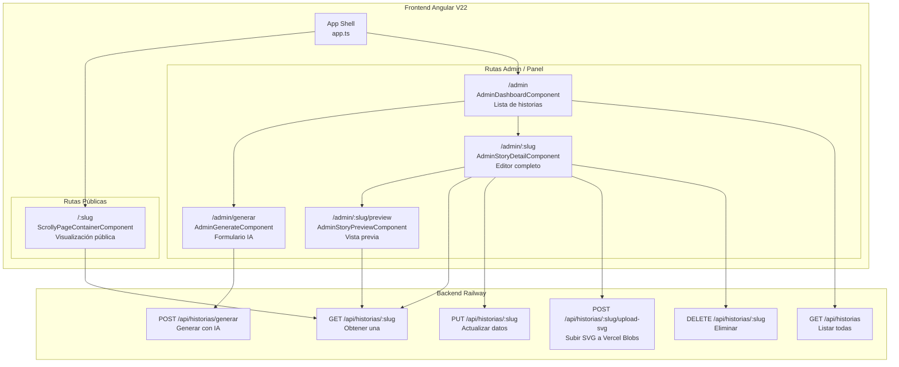
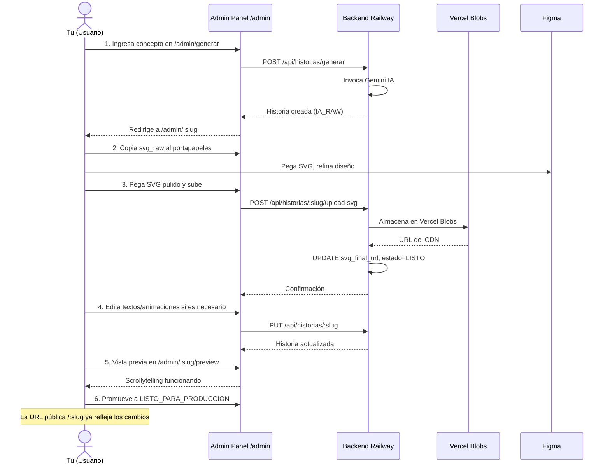

# Panel Admin — Arquitectura para operación remota

## 1. Diagnóstico del flujo diario actual

Actualmente, las operaciones del MVP requieren herramientas externas:

| Operación Diaria | Herramienta Actual | Fuente |
|-----------------|-------------------|--------|
| Listar historias | `SELECT *` en Neon Console | [`see-stories.sql`](workflows/daily/see-stories.sql) |
| Editar textos/escenas | `UPDATE jsonb_set()` en Neon | [`modify-keyframes.sql`](workflows/daily/modify-keyframes.sql) |
| Subir SVG a CDN | Dashboard Vercel Blobs manual | Paso 3 del [`README-MVP.md`](README-MVP.md) |
| Cambiar estado | `UPDATE estado =` manual | Paso 4 del README-MVP |
| Previsualizar SVG | Copiar/pegar en Figma | Paso 2 del README-MVP |
| Generar historia | `curl POST` a Railway | Paso 1 del README-MVP |

**Problema:** En remoto, cada operación requiere abrir 3-4 pestañas distintas y ejecutar comandos SQL manuales.

## 2. Solución: Panel Admin Unificado

Ruta base: `https://tu-app.vercel.app/admin`



## 3. Backend — Nuevos endpoints necesarios

Basado en el controller actual [`story.controller.ts`](backend/src/controllers/story.controller.ts):

### Endpoint 1: `GET /api/historias` — Listar todas las historias

```
GET /api/historias
Query params: ?estado=IA_RAW  (opcional, filtra por estado)

Response 200:
[
  {
    "id": 1,
    "slug": "bitcoin-pow-consensus",
    "titulo": "Consenso Proof of Work en Bitcoin",
    "estado": "IA_RAW" | "EDITANDO_FIGMA" | "LISTO_PARA_PRODUCCION",
    "svg_final_url": "https://..." | null,
    "creado_en": "2026-07-24T...",
    "actualizado_en": "2026-07-24T..."
  }
]
```

### Endpoint 2: Desbloquear `POST /api/historias/:slug/upload-svg` — Subir SVG a Vercel Blobs

Actualmente comentado en [`story.controller.ts`](backend/src/controllers/story.controller.ts#L44-L65). Requiere:

1. Agregar dependencia `@vercel/blob` al backend
2. Implementar la función `subirSvgABlob(slug, svgRawText)`
3. Configurar variable de entorno `BLOB_READ_WRITE_TOKEN` en Railway

```
POST /api/historias/:slug/upload-svg
Body: { "svgRawText": "<svg>...</svg>" }

Response 200:
{
  "slug": "bitcoin-pow-consensus",
  "svg_final_url": "https://blob.vercel-storage.com/...",
  "estado": "LISTO_PARA_PRODUCCION"
}
```

### Endpoint 3: `DELETE /api/historias/:slug` — Eliminar historia

```
DELETE /api/historias/:slug

Response 200: { "message": "Historia eliminada correctamente" }
```

## 4. Frontend — Nuevos componentes

### 4.1 Servicio: [`AdminService`](frontend/src/app/services/admin.service.ts)

```
AdminService (inyectable)
├── listarHistorias(estado?: string): Observable<HistoriaResumen[]>
├── obtenerHistoria(slug: string): Observable<HistoriaScrollyEntity>
├── generarHistoria(concepto: string): Observable<HistoriaScrollyEntity>
├── actualizarHistoria(slug, datos): Observable<HistoriaScrollyEntity>
├── subirSvg(slug, svgRawText): Observable<{ svg_final_url }>
├── eliminarHistoria(slug): Observable<void>
└── cambiarEstado(slug, estado): Observable<HistoriaScrollyEntity>
```

### 4.2 Componentes

#### `AdminDashboardComponent` — Lista de historias

```
Route: /admin
Data: signal<HistoriaResumen[]>
UI:
├── Botón "Generar nueva historia" → navega a /admin/generar
├── Filtro por estado (tabs: Todas | IA_RAW | EDITANDO_FIGMA | LISTO_PARA_PRODUCCION)
└── Tabla de historias:
    ├── Slug (link a /admin/:slug)
    ├── Título
    ├── Badge de estado (con color: rojo=RAW, amarillo=EDITANDO, verde=LISTO)
    ├── Fecha de creación
    ├── Indicador de SVG subido (sí/no)
    └── Botón "Vista previa" → navega a /:slug
```

#### `AdminGenerateComponent` — Generar nueva historia

```
Route: /admin/generar
UI:
├── Campo de texto: "Concepto técnico a explicar"
├── Botón "Generar con IA" → POST /api/historias/generar
├── Estado: loading (spinner), success (redirigir a /admin/:slug), error
└── Sugerencias rápidas: "Proof of Stake", "OAuth2 Flow", "Diffie-Hellman"
```

#### `AdminStoryDetailComponent` — Editor completo de historia

```
Route: /admin/:slug
Data: resource<HistoriaScrollyEntity>
UI:
├── Sección 1: Metadatos
│   ├── Slug (solo lectura)
│   ├── Título (editable inline)
│   └── Estado (dropdown selector + botón "Promover a siguiente etapa")
│
├── Sección 2: SVG Preview
│   ├── Muestra SVG actual (crudo de IA o URL de Vercel Blobs)
│   ├── Botón "Copiar SVG raw" (para llevar a Figma)
│   └── Área de texto para pegar SVG refinado de Figma + Botón "Subir a Vercel Blobs"
│
├── Sección 3: Escenas (lista ordenada)
│   └── Por cada escena:
│       ├── Número de paso (reordenable)
│       ├── Texto explicativo (textarea editable)
│       └── Animación:
│           ├── targetId (input text, autocompletado desde IDs del SVG)
│           ├── Opacity (slider 0-1)
│           ├── Scale (slider 0-5)
│           ├── X / Y (slider -500 a 500)
│           └── Rotation (slider 0-360)
│
└── Botón "Guardar cambios" → PUT /api/historias/:slug
    Botón "Vista previa" → navega a /admin/:slug/preview
    Botón "Eliminar historia" → DELETE + redirect a /admin
```

#### `AdminStoryPreviewComponent` — Vista previa

```
Route: /admin/:slug/preview
UI: 
├── Reutiliza <app-scrolly-story> con los datos actuales
├── Banner superior "🔍 Modo vista previa — volver a editor"
└── Usa los datos de json_modificado sin necesidad de publicar
```

### 4.3 Rutas

Modificar [`app.routes.ts`](frontend/src/app/app.routes.ts):

```typescript
export const routes: Routes = [
  // Admin routes (deben ir ANTES de :slug para evitar conflictos)
  { path: 'admin', component: AdminDashboardComponent },
  { path: 'admin/generar', component: AdminGenerateComponent },
  { path: 'admin/:slug', component: AdminStoryDetailComponent },
  { path: 'admin/:slug/preview', component: AdminStoryPreviewComponent },
  
  // Public routes
  { path: ':slug', component: ScrollyPageContainerComponent },
  { path: '', redirectTo: '/bitcoin-pow-consensus', pathMatch: 'full' }
];
```

## 5. Árbol de archivos completo

```
frontend/src/app/
├── admin/
│   ├── admin-dashboard.component.ts
│   ├── admin-generate.component.ts
│   ├── admin-story-detail.component.ts
│   └── admin-story-preview.component.ts
├── services/
│   ├── story.service.ts          ← existente
│   └── admin.service.ts          ← nuevo (CRUD completo)
├── components/
│   ├── scrolly-page-container.component.ts  ← ya migrado a Signals
│   └── scrolly-story.component.ts           ← ya migrado a Signals
├── directives/
│   └── svg-inline.directive.ts              ← ya migrado a Signals
├── app.routes.ts                 ← modificado
└── app.config.ts                 ← sin cambios

backend/src/
├── controllers/
│   └── story.controller.ts       ← modificado (listar, upload-svg, delete)
├── services/
│   └── ai.service.ts             ← sin cambios
├── shared/
│   └── interfaces.ts             ← sin cambios
└── index.ts                      ← sin cambios
```

## 6. Flujo de operación diaria con el Admin Panel



## 7. Dependencias nuevas

### Backend
```json
{
  "dependencies": {
    "@vercel/blob": "^1.0.0"  // Para subir SVGs a Vercel Blobs
  }
}
```

### Frontend
Sin nuevas dependencias. Todo con Angular 22 nativo + Signals.

## 8. Orden de implementación sugerido

| # | Tarea | Archivos | Depende de |
|---|-------|----------|-----------|
| 1 | Endpoint `GET /api/historias` | [`story.controller.ts`](backend/src/controllers/story.controller.ts) | — |
| 2 | Endpoint `DELETE /api/historias/:slug` | [`story.controller.ts`](backend/src/controllers/story.controller.ts) | — |
| 3 | Endpoint `POST upload-svg` + dep `@vercel/blob` | [`story.controller.ts`](backend/src/controllers/story.controller.ts) + package.json | Vercel BLOB_TOKEN |
| 4 | Servicio `AdminService` | [`admin.service.ts`](frontend/src/app/services/admin.service.ts) | Endpoints #1-3 |
| 5 | Componente `AdminDashboardComponent` | admin-dashboard.component.ts | AdminService |
| 6 | Componente `AdminGenerateComponent` | admin-generate.component.ts | AdminService |
| 7 | Componente `AdminStoryDetailComponent` | admin-story-detail.component.ts | AdminService |
| 8 | Componente `AdminStoryPreviewComponent` | admin-story-preview.component.ts | reutiliza ScrollyStory |
| 9 | Rutas admin en `app.routes.ts` | [`app.routes.ts`](frontend/src/app/app.routes.ts) | Componentes #5-8 |
| 10 | Despliegue frontend a Vercel | vercel.json, CI | Todo lo anterior |
